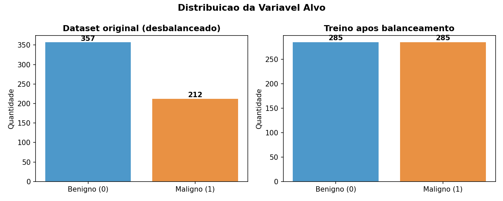
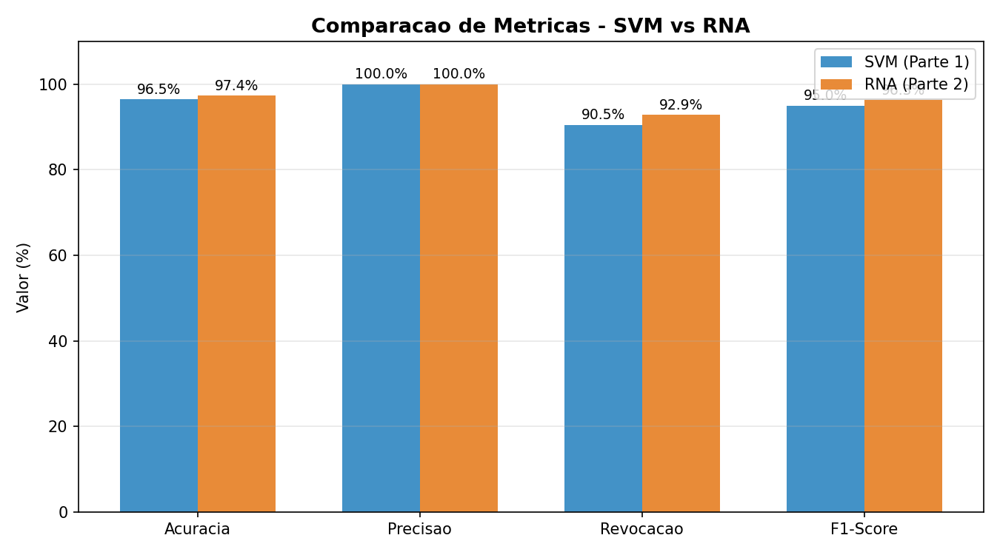
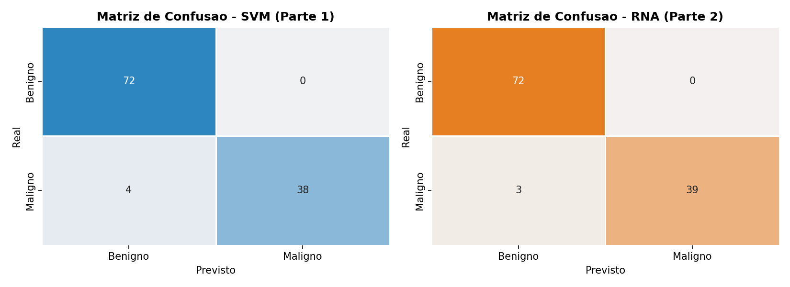
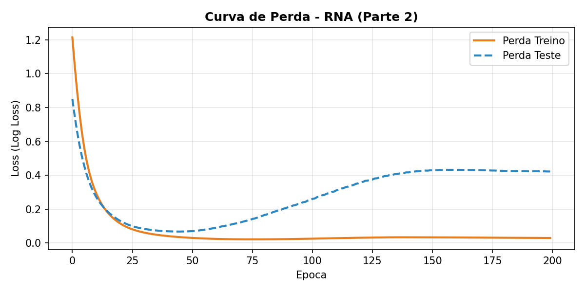

Disciplina de Inteligência Artificial, Professor Munif, Unicesumar 2026

# Classificação de Tumores de Mama com SVM e Redes Neurais

## Integrantes
- Ricardo Guilhen Melo - RA: 23013569-2

---

## Resumo do Projeto

### Contextualização
O câncer de mama é um dos tipos de câncer mais comuns entre mulheres no mundo. O diagnóstico precoce é decisivo para o sucesso do tratamento. A partir de imagens digitalizadas de exames (punção aspirativa por agulha fina), é possível medir características dos núcleos celulares — como raio, textura, perímetro e concavidade. Técnicas de Inteligência Artificial podem usar essas medidas para auxiliar o médico a distinguir tumores **malignos** de **benignos**.

### Problema
Este trabalho investiga a seguinte questão: **a partir das características numéricas extraídas do exame de um tumor de mama, é possível prever automaticamente se ele é maligno (1) ou benigno (0)?**

Trata-se de um problema de **classificação binária**.

### Hipótese
Nossa hipótese é que modelos de IA treinados com as características dos núcleos celulares conseguem classificar os tumores com acurácia superior a 90%, e que a **Rede Neural (RNA)** tende a superar o **SVM** por sua maior capacidade de aprender padrões não-lineares complexos. Além disso, esperamos que o **balanceamento das classes** melhore a capacidade de identificar corretamente os casos malignos (a classe minoritária e mais importante de detectar).

### Dataset
Utilizamos o **Breast Cancer Wisconsin (Diagnostic) Dataset**, amplamente usado em pesquisas de Machine Learning.

- **Origem:** UCI Machine Learning Repository, disponível na biblioteca scikit-learn (`sklearn.datasets.load_breast_cancer`).
- **Registros:** 569 exames de tumores de mama.
- **Atributos:** 30 variáveis numéricas de entrada + 1 variável alvo.
- **Variável alvo:** `diagnostico` — 0 (benigno) ou 1 (maligno).
- **Distribuição:** 357 benignos (62,7%) e 212 malignos (37,3%) — **dataset desbalanceado**.

> Observação: no scikit-learn o alvo original vem como 0 = maligno e 1 = benigno. No nosso projeto invertemos para **1 = maligno** e **0 = benigno**, porque a classe de interesse (que queremos detectar) é o tumor maligno, que também é a classe minoritária.

#### Atributos principais
As 30 variáveis correspondem à média, ao erro padrão e ao "pior" valor de 10 características medidas em cada núcleo celular:

| Característica | Descrição |
|---|---|
| radius | Raio (distância do centro à borda) |
| texture | Variação dos níveis de cinza |
| perimeter | Perímetro |
| area | Área |
| smoothness | Suavidade do contorno |
| compactness | Compacidade (perímetro² / área) |
| concavity | Severidade das partes côncavas do contorno |
| concave points | Número de partes côncavas do contorno |
| symmetry | Simetria |
| fractal dimension | Dimensão fractal ("aproximação da linha costeira") |

#### Preparação dos dados
1. **Divisão treino/teste:** 80% treino (455 amostras) / 20% teste (114 amostras), com **estratificação** (`stratify`), que mantém a mesma proporção de classes nos dois conjuntos.
2. **Normalização (StandardScaler):** todos os atributos foram colocados na mesma escala (média 0, desvio 1). O *scaler* é ajustado **apenas no treino** e aplicado ao teste, evitando vazamento de informação (*data leakage*).
3. **Balanceamento das classes:** ver seção dedicada abaixo.

---

## Balanceamento das Classes

Como o dataset é desbalanceado (62,7% benigno × 37,3% maligno), um modelo poderia obter boa acurácia simplesmente "chutando" sempre a classe majoritária — e errar justamente os casos malignos, que são os mais críticos.

Para evitar isso, o balanceamento foi tratado em **dois momentos**, ambos visíveis no código (`main.py`):

1. **Na divisão treino/teste (`train_test_split` com `stratify=y`):** garante que a proporção de classes seja a **mesma** no conjunto de treino e no de teste. Ou seja, treino e teste ficam balanceados na mesma proporção um em relação ao outro.

2. **No conjunto de treino (função `balancear_classes`):** aplicamos **oversampling** da classe minoritária (maligno). A função sorteia cópias das amostras malignas, com reposição, até que as duas classes fiquem com o mesmo número de exemplos (285 × 285). Assim o modelo aprende as duas classes com igual importância.

O conjunto de **teste é mantido na proporção real** (não é reamostrado), para que a avaliação reflita o mundo real. Para que o desbalanceamento do teste não distorça a leitura, além da acurácia comum reportamos também a **acurácia balanceada** e a **revocação** da classe maligna.

O gráfico abaixo mostra a distribuição original (desbalanceada) e o conjunto de treino após o balanceamento:



---

## Métodos Utilizados

### Parte 1 — SVM (Support Vector Machine)
O SVM é um método de aprendizado supervisionado que busca o **hiperplano de máxima margem** que separa as duas classes — ou seja, a fronteira que fica o mais distante possível dos pontos de cada classe. Usamos o **kernel RBF** (Radial Basis Function), que permite separar classes que não são linearmente separáveis, projetando os dados em um espaço de maior dimensão.

**Parâmetros:** `kernel='rbf'`, `C=10` (controla a tolerância a erros de classificação), `gamma='scale'` (define o alcance da influência de cada ponto).

### Parte 2 — RNA (Rede Neural Artificial / MLP)
A RNA é uma rede neural do tipo **Perceptron Multicamadas (MLP)**. Ela é composta por camadas de neurônios conectados, onde cada conexão tem um peso ajustado durante o treinamento.

**Arquitetura da rede:**

```
Entrada (30 neurônios)  →  Camada oculta 1 (32 neurônios, ReLU)
                        →  Camada oculta 2 (16 neurônios, ReLU)
                        →  Saída (1 neurônio, probabilidade de maligno)
```

- **Camada de entrada:** 30 neurônios, um para cada atributo do exame.
- **Camadas ocultas:** duas camadas (32 e 16 neurônios), ambas com ativação **ReLU** (`f(x) = max(0, x)`), que introduz não-linearidade e permite a rede aprender padrões complexos.
- **Camada de saída:** 1 neurônio, que produz a probabilidade do tumor ser maligno.
- **Otimizador:** Adam, com taxa de aprendizado 0,001.
- **Treinamento:** 200 épocas (cada época é uma passagem completa pelos dados de treino). A cada época registramos a perda (*loss*) para desenhar a curva de aprendizado.

---

## Avaliação dos Modelos

As métricas foram calculadas sobre o conjunto de **teste** (114 amostras nunca vistas no treino). A classe positiva é **maligno (1)**.

### Como as métricas são calculadas (matriz de confusão)

Todas as métricas saem da **matriz de confusão**, que cruza o valor real com o previsto:

| | Previsto: Benigno | Previsto: Maligno |
|---|---|---|
| **Real: Benigno** | VN (Verdadeiro Negativo) | FP (Falso Positivo) |
| **Real: Maligno** | FN (Falso Negativo) | VP (Verdadeiro Positivo) |

- **VP (Verdadeiro Positivo):** maligno corretamente classificado como maligno.
- **VN (Verdadeiro Negativo):** benigno corretamente classificado como benigno.
- **FP (Falso Positivo):** benigno classificado como maligno (alarme falso).
- **FN (Falso Negativo):** maligno classificado como benigno — **o erro mais grave**, pois deixa de detectar um câncer.

A partir desses valores:
- **Acurácia** = (VP + VN) / total → proporção de acertos.
- **Precisão** = VP / (VP + FP) → dos classificados como maligno, quantos eram mesmo.
- **Revocação** = VP / (VP + FN) → dos malignos reais, quantos o modelo encontrou.
- **F1-Score** = média harmônica entre precisão e revocação.

### Resultados (valores reais obtidos)

**Matriz de confusão — SVM:** VN=72, FP=0, FN=4, VP=38
**Matriz de confusão — RNA:** VN=72, FP=0, FN=3, VP=39

| Métrica | SVM (Parte 1) | RNA (Parte 2) |
|---|---|---|
| Acurácia | 96,49% | **97,37%** |
| Acurácia Balanceada | 95,24% | **96,43%** |
| Precisão | 100,00% | 100,00% |
| Revocação | 90,48% | **92,86%** |
| F1-Score | 95,00% | **96,30%** |

### Gráfico 1 — Comparação de Métricas


### Gráfico 2 — Matrizes de Confusão


### Gráfico 3 — Curva de Perda da RNA


A curva de perda mostra a perda caindo rapidamente nas primeiras épocas. A partir de aproximadamente a época 50, a perda de **treino** continua caindo enquanto a de **teste** começa a subir — sinal clássico de **overfitting** (a rede começa a "decorar" o treino). Mesmo assim, a acurácia final no teste permaneceu alta.

---

## Comparação e Conclusão

### Comparação dos resultados
A **RNA superou o SVM em todas as métricas**: acurácia (97,37% vs 96,49%), revocação (92,86% vs 90,48%) e F1-Score (96,30% vs 95,00%). Ambos os modelos atingiram **precisão de 100%** (nenhum falso positivo), o que significa que, quando previam "maligno", estavam sempre certos.

A diferença decisiva está na **revocação**: a RNA deixou de detectar apenas 3 tumores malignos (FN=3), contra 4 do SVM (FN=4). Em um problema médico, o falso negativo é o erro mais perigoso — por isso a revocação é a métrica mais importante aqui, e a RNA se saiu melhor.

O **balanceamento** foi importante para esse resultado: ao treinar com as classes equilibradas, os modelos não ficaram enviesados para a classe majoritária (benigno) e conseguiram alta revocação na classe maligna.

### Conclusão
A hipótese foi **confirmada**: os modelos superaram 90% de acurácia, a RNA superou o SVM em todas as métricas, e o balanceamento contribuiu para a boa detecção da classe maligna. O trabalho percorreu todo o pipeline de uma solução de IA: definição do problema, preparação e balanceamento dos dados, treinamento de um método da Parte 1 (SVM) e de um da Parte 2 (RNA), avaliação com métricas e gráficos, e comparação crítica.

Como trabalho futuro, seria interessante aplicar técnicas de balanceamento mais sofisticadas (como SMOTE), usar *early stopping* para conter o overfitting observado na curva de perda, e validar os resultados com *validação cruzada* (k-fold).

---

## Estrutura do Repositório

```
.
├── README.md                  # Este arquivo
├── relatorio.pdf              # Versão em PDF com o mesmo conteúdo
├── gerar_dataset.py           # Gera o cancer_mama.csv a partir do scikit-learn
├── main.py                    # Script principal: treina, balanceia, avalia e gera gráficos
├── requirements.txt           # Dependências
├── cancer_mama.csv            # Dataset utilizado (569 exames)
├── graficos/                  # Gráficos gerados pelo main.py
│   ├── 01_distribuicao_alvo.png
│   ├── 02_comparacao_metricas.png
│   ├── 03_matrizes_confusao.png
│   └── 04_curva_perda_rna.png
└── modelos/                   # Modelos treinados
    ├── svm_modelo.pkl
    ├── rna_modelo.pkl
    └── scaler.pkl
```

---

## Como Executar

### Pré-requisitos
```bash
pip install -r requirements.txt
```

### Execução
```bash
# 1. (Opcional) Gera o CSV do dataset a partir do scikit-learn
python gerar_dataset.py

# 2. Treina os modelos, balanceia, avalia e gera os gráficos
python main.py
```

Os gráficos são salvos em `graficos/` e os modelos treinados em `modelos/`.

### Modelos treinados
Os modelos já estão salvos na pasta `modelos/`:
- `modelos/svm_modelo.pkl` — modelo SVM treinado (Parte 1)
- `modelos/rna_modelo.pkl` — modelo RNA treinado (Parte 2)
- `modelos/scaler.pkl` — normalizador StandardScaler (necessário para preparar dados novos antes da predição)
